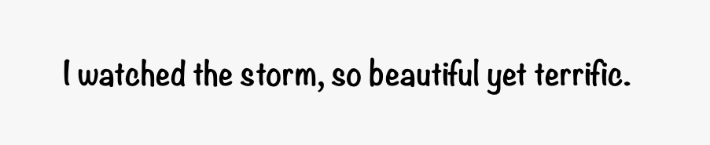

# SCTypeKit
*SCTypeKit()* is help us to easy that, currying style of construct `attributedString` and `UIFont`


[](https://travis-ci.org/interactord/SCTypeKit)
[](https://cocoapods.org/pods/SCTypeKit)

# 📚 Overview



```swift
let builder = AttributedStringBuilder()

let shadow = NSShadow()
shadow.shadowColor = UIColor.black
shadow.shadowBlurRadius = 1.2
shadow.shadowOffset = .init(width: 1, height: 1)

view.numberOfLines = 0
view.textAlignment = .center
view.attributedText = builder
  .text("It", attributes: [
    .font(UIFont.systemFont(ofSize: 50, weight: .semibold)),
    .textColor(.darkGray),
    .alignment(.center),
    .kerning(5)
  ])
  .space()
  .text("was going", attributes: [
    .font(UIFont.systemFont(ofSize: 70, weight: .medium)),
    .textColor(.gray),
  ])
  .spaces(5)
  .text("to", attributes: [
    .font(UIFont.systemFont(ofSize: 90, weight: .semibold)),
    .textColor(.lightGray)
  ])
  .spaces(5)
  .text("be", attributes: [
    .font(UIFont(name: "AvenirNext-Bold", size: 70)!),
    .textColor(UIColor.yellow),
    .kerning(5),
    .shadow(shadow),
    .skew(0.3),
    .underline(true)
  ])
  .spaces(15)
  .text("a lonely", attributes: [
    .font(UIFont(name: "SnellRoundhand", size: 60)!),
    .textColor(.purple),
    .kerning(5)
  ])
  .spaces(20)
  .text("Back", attributes: [
    .font(UIFont(name: "Marker Felt", size: 50)!),
    .textColor(.white),
    .strokeColor(.red),
    .strokeWidth(2)
  ])
  .build()
```

# Installation

* **Using [Cocoapods](https://cocoapods.org)**:
    ```ruby
    pod 'SCTypeKit'
    ```

* **Using [Carthage](https://github.com/Carthage/Carthage)**:
    ```ruby
    github 'interactord/SCTypeKit'
    ```

## License
SCTypeKit is under MIT license. See th [LICENSE](LICENSE.md) file for more info.